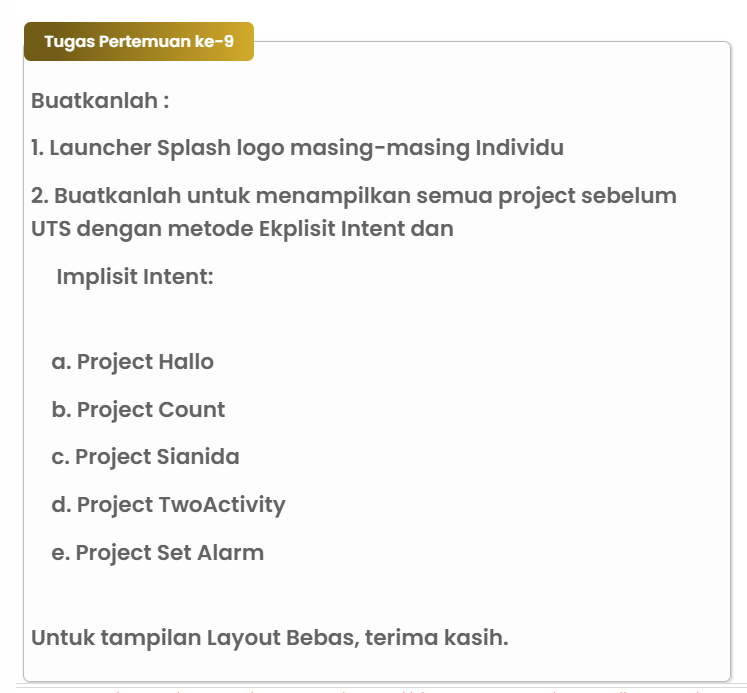

# Ekplisit Intents Dan Implisit Intents
# Nama : Muhammad Din Al Ayubi
# NIM : 312210293
# Kelas : TI.22.A3

# Tugas

# Input
## ```AndroidManifest.xml```
```python
<?xml version="1.0" encoding="utf-8"?>
<manifest xmlns:android="http://schemas.android.com/apk/res/android">

    <uses-permission android:name="com.android.alarm.permission.SET_ALARM" />

    <application
        android:allowBackup="true"
        android:icon="@drawable/ay"
        android:label="mdinalayubi"
        android:roundIcon="@drawable/ay"
        android:supportsRtl="true"
        android:theme="@style/Theme.HelloToast">


        <activity
            android:name=".MainLauncherSplashLogo"
            android:exported="true">
            <intent-filter>
                <action android:name="android.intent.action.MAIN" />
                <category android:name="android.intent.category.LAUNCHER" />
            </intent-filter>
        </activity>

        <activity android:name=".MainHomePage"></activity>
        <activity android:name=".MainActivity"></activity>
        <activity android:name=".MainScrollice"></activity>
        <activity android:name=".MainToast"></activity>
        <activity android:name=".MainFirstActivity"></activity>

    </application>
</manifest>
```
# ```Java```
## ```MainActivity.java```
```python
package com.hellotoast;

import android.os.Bundle;

import androidx.appcompat.app.AppCompatActivity;

public class MainActivity extends AppCompatActivity {

    @Override
    protected void onCreate(Bundle savedInstanceState) {
        super.onCreate(savedInstanceState);
        setContentView(R.layout.activity_main);
    }
}
```
## ```MainFirstActivity.java```
```python
package com.hellotoast;

import android.content.Intent;
import android.os.Bundle;
import android.util.Log;
import android.view.View;
import android.widget.EditText;
import android.widget.TextView;

import androidx.appcompat.app.AppCompatActivity;

public class MainFirstActivity extends AppCompatActivity {
    private static final String LOG_TAG = MainFirstActivity.class.getSimpleName();
    public static final String EXTRA_MESSAGE = "com.example.android.hellotoast.extra.MESSAGE";
    public static final int TEXT_REQUEST = 1;
    private EditText mMessageEditText;
    private TextView mReplyHeadTextView;
    private TextView mReplyTextView;

    @Override
    protected void onCreate (Bundle savedInstanceState) {
        super .onCreate(savedInstanceState);
        setContentView(R.layout.activity_satu);
        mMessageEditText = findViewById(R.id.editText_main);
        mReplyHeadTextView = findViewById(R.id.text_header_reply);
        mReplyTextView = findViewById(R.id.text_message_reply);
    }
    public void launchSecondActivity(View view) {
        Log.d(LOG_TAG, "Button diklik");
        Intent tampil = new Intent(this, MainSecondActivity.class);
        String pesan = mMessageEditText.getText().toString();
        tampil.putExtra(EXTRA_MESSAGE, pesan);
        startActivityForResult(tampil, TEXT_REQUEST);
    }
    @Override
    public void onActivityResult(int requestCode, int resultCode, Intent data){
        super.onActivityResult(requestCode, resultCode, data);
        if (requestCode == TEXT_REQUEST ){
            if (resultCode == RESULT_OK) {
                String reply = data.getStringExtra(MainSecondActivity.EXTRA_REPLY);
                mReplyHeadTextView.setVisibility(View.VISIBLE);
                mReplyTextView.setText(reply);
                mReplyTextView.setVisibility(View.VISIBLE);
            }
        }
    }
}

```
## ```MainHomePage.java```
```python
package com.hellotoast;

import android.content.Intent;
import android.os.Bundle;
import android.provider.AlarmClock;
import android.view.View;
import android.widget.Button;

import androidx.appcompat.app.AppCompatActivity;

import java.util.ArrayList;

public class MainHomePage extends AppCompatActivity {

    Button btnHello;
    Button btnCount;
    Button btnSianida;
    Button btnTwoActivity;

    @Override
    protected void onCreate(Bundle savedInstanceState) {
        super.onCreate(savedInstanceState);
        setContentView(R.layout.activity_home);

        setLayout();
        setKlik();
    }

    void setLayout() {
        btnHello = findViewById(R.id.btnHello);
        btnCount = findViewById(R.id.btnCount);
        btnSianida = findViewById(R.id.btnSianida);
        btnTwoActivity = findViewById(R.id.btnTwoActivity);
    }

    void setKlik() {
        btnHello.setOnClickListener(new View.OnClickListener() {
            @Override
            public void onClick(View view) {
                Intent intenthello = new Intent(MainHomePage.this, MainActivity.class);
                startActivity(intenthello);
            }
        });

        btnCount.setOnClickListener(new View.OnClickListener() {
            @Override
            public void onClick(View view) {
                Intent intentcount = new Intent(MainHomePage.this, MainToast.class);
                startActivity(intentcount);
            }
        });

        btnSianida.setOnClickListener(new View.OnClickListener() {
            @Override
            public void onClick(View view) {
                Intent intentsianida = new Intent(MainHomePage.this, MainScrollice.class);
                startActivity(intentsianida);
            }
        });

        btnTwoActivity.setOnClickListener(new View.OnClickListener() {
            @Override
            public void onClick(View view) {
                Intent intenttwoactivity = new Intent(MainHomePage.this, MainFirstActivity.class);
                startActivity(intenttwoactivity);
            }
        });
    }

    public void createAlarm(View view) {
        ArrayList<Integer> alarmDays = new ArrayList<>();
        alarmDays.add(2);
        alarmDays.add(3);
        alarmDays.add(4);
        Intent intent = new Intent(AlarmClock.ACTION_SET_ALARM)
                .putExtra(AlarmClock.EXTRA_DAYS, alarmDays)
                .putExtra(AlarmClock.EXTRA_MESSAGE, "Testing")
                .putExtra(AlarmClock.EXTRA_HOUR, 7)
                .putExtra(AlarmClock.EXTRA_MINUTES, 30)
                .putExtra(AlarmClock.EXTRA_VIBRATE, false)
                .putExtra(AlarmClock.EXTRA_RINGTONE, "VALUE_RINGTONE_SILENT");
        if (intent.resolveActivity(getPackageManager()) != null) {
            startActivity(intent);
        }
    }
}

```
## ```MainLauncherSplashLogo.java```
```python
package com.hellotoast;

import android.content.Intent;
import android.os.Bundle;
import android.os.Handler;
import android.view.View;

import androidx.appcompat.app.AppCompatActivity;

public class MainLauncherSplashLogo extends AppCompatActivity {

    @Override
    protected void onCreate(Bundle savedInstanceState) {
        super.onCreate(savedInstanceState);
        setContentView(R.layout.activity_launcher_splash_logo);

        View decorView = getWindow().getDecorView();
        // Hide the status bar.
        int uiOptions = View.SYSTEM_UI_FLAG_FULLSCREEN;
        decorView.setSystemUiVisibility(uiOptions);
        // Hide ActionBar
        if (getSupportActionBar() != null) {
            getSupportActionBar().hide();
        }
        new Handler().postDelayed(new Runnable() {
            @Override
            public void run() {
                startActivity(new Intent(MainLauncherSplashLogo.this, MainHomePage.class));
                finish();
            }
        }, 2000); // Ubah delayMillis menjadi 2000
    }
}

```
## ```MainScrollice.java```
```python
package com.hellotoast;

import android.os.Bundle;

import androidx.appcompat.app.AppCompatActivity;

public class MainScrollice extends AppCompatActivity {

    @Override
    protected void onCreate(Bundle savedInstanceState) {
        super .onCreate(savedInstanceState);
        setContentView(R.layout.activity_scrollice);
    }
}

```
## ```MainSecondActivity.java```
```python
package com.hellotoast;

import android.content.Intent;
import android.os.Bundle;
import android.view.View;
import android.widget.EditText;
import android.widget.TextView;

import androidx.appcompat.app.AppCompatActivity;

public class MainSecondActivity extends AppCompatActivity {
    public static final String EXTRA_REPLY = "com.example.android.hellotoast.extra.REPLY";
    private EditText mReply;
    @Override
    protected void onCreate (Bundle savedInstanceState){
        super .onCreate(savedInstanceState);
        setContentView(R.layout.activity_dua);
        mReply = findViewById(R.id.editText_second);
        Intent tampil = getIntent();
        String pesan = tampil.getStringExtra(MainFirstActivity.EXTRA_MESSAGE);
        TextView textView = findViewById(R.id.text_message);
        textView.setText(pesan);
    }
    public void returnReply(View view){
        String reply = mReply.getText().toString();
        Intent replyIntent = new Intent();
        replyIntent.putExtra(EXTRA_REPLY, reply);
        setResult(RESULT_OK, replyIntent);
        finish();
    }
}

```
## ```MainToast.java```
```python
package com.hellotoast;

import android.os.Bundle;
import android.view.View;
import android.widget.EditText;
import android.widget.TextView;
import android.widget.Toast;

import androidx.appcompat.app.AppCompatActivity;

public class MainToast extends AppCompatActivity {
    private TextView showCount;
    private int count = 0;
    private long fibNMinus1 = 1;
    private long fibNMinus2 = 0;
    private EditText edit_max_fibonacci;

    @Override
    protected void onCreate(Bundle savedInstanceState) {
        super.onCreate(savedInstanceState);
        setContentView(R.layout.activity_toast);

        showCount = findViewById(R.id.show_count);
        edit_max_fibonacci = findViewById(R.id.edit_max_fibonacci);

        updateCountDisplay();

        fibNMinus1 = 0;
        fibNMinus2 = 1;
    }

    private void updateCountDisplay() {
        showCount.setText(String.valueOf(fibNMinus2));

        if (count % 4 == 0) {
            showCount.setTextColor(getResources().getColor(R.color.colorPrimary));
        } else if (count % 4 == 1) {
            showCount.setTextColor(getResources().getColor(R.color.colorAccent));
        } else if (count % 4 == 2) {
            showCount.setTextColor(getResources().getColor(R.color.colorPrimary));
        } else {
            showCount.setTextColor(getResources().getColor(R.color.colorAccent));
        }
    }

    public void showToast(View view) {
        Toast.makeText(this, "Bilangan Fibonacci", Toast.LENGTH_SHORT).show();
    }

    public void countUp(View view) {
        String maxFibonacciStr = edit_max_fibonacci.getText().toString();

        if (maxFibonacciStr.isEmpty()) {
            Toast.makeText(this, "Masukkan nilai maksimum Fibonacci terlebih dahulu", Toast.LENGTH_SHORT).show();
            return;
        }

        int maxFibonacci = Integer.parseInt(maxFibonacciStr);

        if (count >= maxFibonacci) {
            Toast.makeText(this, "Maksimum Fibonacci tercapai", Toast.LENGTH_SHORT).show();
            return;
        }

        long fibCurrent;
        if (count == 0 || count == 1) {
            fibCurrent = 1;
        } else {
            fibCurrent = fibNMinus1 + fibNMinus2;
        }

        fibNMinus2 = fibNMinus1;
        fibNMinus1 = fibCurrent;
        updateCountDisplay();

        count++;
    }

    public void back1(View view) {
        count = 1;
        fibNMinus1 = 1;
        fibNMinus2 = 0;
        updateCountDisplay();
    }
}
```
# ```Activity```
## ```activity_launcher_splash_logo.xml```
```python
<?xml version="1.0" encoding="utf-8"?>
<RelativeLayout xmlns:android="http://schemas.android.com/apk/res/android"
    xmlns:tools="http://schemas.android.com/tools"
    android:layout_width="match_parent"
    android:layout_height="match_parent"
    android:background="#FFFFFF"
    tools:content=".MainLauncherSplashLogo">

    <LinearLayout
        android:layout_width="match_parent"
        android:layout_height="wrap_content"
        android:layout_centerInParent="true"
        android:gravity="center"
        android:orientation="vertical">

        <ImageView
            android:id="@+id/mdinalayubi_logo_transparant_2"
            android:layout_width="350dp"
            android:layout_height="wrap_content"
            android:adjustViewBounds="true"
            android:src="@drawable/ay" />

    </LinearLayout>

</RelativeLayout>
```
## ```activity_home.xml```
```python
<?xml version="1.0" encoding="utf-8"?>
<LinearLayout xmlns:android="http://schemas.android.com/apk/res/android"
    xmlns:tools="http://schemas.android.com/tools"
    android:layout_width="match_parent"
    android:layout_height="match_parent"
    android:layout_marginStart="0dp"
    android:layout_marginEnd="0dp"
    android:background="#050505"
    android:gravity="center_vertical"
    android:orientation="vertical"
    tools:context=".MainLauncherSplashLogo">

    <Button
        android:id="@+id/btnHello"
        android:layout_width="match_parent"
        android:layout_height="wrap_content"
        android:layout_marginStart="50dp"
        android:layout_marginEnd="50dp"
        android:text="Project Hello Toast"
        android:textStyle="italic"
        android:textColor="@color/black"/>

    <Button
        android:id="@+id/btnCount"
        android:layout_width="match_parent"
        android:layout_height="wrap_content"
        android:layout_marginStart="50dp"
        android:layout_marginEnd="50dp"
        android:text="Project Count"
        android:textStyle="italic"
        android:textColor="@color/black"/>

    <Button
        android:id="@+id/btnSianida"
        android:layout_width="match_parent"
        android:layout_height="wrap_content"
        android:layout_marginStart="50dp"
        android:layout_marginEnd="50dp"
        android:text="Project Kasus Sianida"
        android:textStyle="italic"
        android:textColor="@color/black"/>

    <Button
        android:id="@+id/btnTwoActivity"
        android:layout_width="match_parent"
        android:layout_height="wrap_content"
        android:layout_marginStart="50dp"
        android:layout_marginEnd="50dp"
        android:text="Project Two Activity"
        android:textStyle="italic"
        android:textColor="@color/black"/>

    <Button
        android:id="@+id/btnAlarm"
        android:layout_width="match_parent"
        android:layout_height="wrap_content"
        android:layout_marginStart="50dp"
        android:layout_marginEnd="50dp"
        android:onClick="createAlarm"
        android:text="Project Set Alarm"
        android:textStyle="italic"
        android:textColor="@color/black"/>
</LinearLayout>
```
## ```activity_main.xml```
```python
<?xml version="1.0" encoding="utf-8"?>
<androidx.constraintlayout.widget.ConstraintLayout xmlns:android="http://schemas.android.com/apk/res/android"
    xmlns:app="http://schemas.android.com/apk/res-auto"
    xmlns:tools="http://schemas.android.com/tools"
    android:layout_width="match_parent"
    android:layout_height="match_parent"
    tools:context=".MainActivity">

    <TextView
        android:layout_width="wrap_content"
        android:layout_height="wrap_content"
        android:text="Bagaimana Kabar Anda Hari Ini!"
        app:layout_constraintBottom_toBottomOf="parent"
        app:layout_constraintEnd_toEndOf="parent"
        app:layout_constraintStart_toStartOf="parent"
        app:layout_constraintTop_toTopOf="parent"
        android:textColor="@color/blue"/>

</androidx.constraintlayout.widget.ConstraintLayout>
```
## ```activity_toast.xml```
```python
<?xml version="1.0" encoding="utf-8"?>
<androidx.constraintlayout.widget.ConstraintLayout
    xmlns:android="http://schemas.android.com/apk/res/android"
    xmlns:app="http://schemas.android.com/apk/res-auto"
    xmlns:tools="http://schemas.android.com/tools"
    android:layout_width="match_parent"
    android:layout_height="match_parent"
    tools:context=".MainActivity">

    <EditText
        android:id="@+id/edit_max_fibonacci"
        android:layout_width="0dp"
        android:layout_height="48dp"
        android:layout_marginEnd="8dp"
        android:layout_marginTop="8dp"
        android:hint="@string/button_label_editText_max"
        android:inputType="number"
        app:layout_constraintEnd_toEndOf="parent"
        app:layout_constraintTop_toTopOf="parent"
        tools:ignore="MissingTranslation"/>

    <Button
        android:id="@+id/button_toast"
        android:layout_width="190dp"
        android:layout_height="48dp"
        android:layout_marginStart="8dp"
        android:layout_marginTop="8dp"
        android:background="@color/blue"
        android:onClick="showToast"
        android:textColor="@android:color/white"
        android:text="@string/button_label_input"
        app:layout_constraintStart_toStartOf="parent"
        app:layout_constraintTop_toTopOf="parent" />


    <Button
        android:id="@+id/button_count"
        android:layout_width="190dp"
        android:layout_height="48dp"
        android:layout_marginStart="8dp"
        android:layout_marginEnd="8dp"
        android:layout_marginBottom="8dp"
        android:background="@color/blue"
        android:onClick="countUp"
        android:text="@string/button_label_count"
        android:textColor="@android:color/white"
        app:layout_constraintBottom_toBottomOf="parent"
        app:layout_constraintEnd_toEndOf="parent"
        app:layout_constraintHorizontal_bias="0.0"
        app:layout_constraintStart_toStartOf="parent"
        tools:ignore="UsingOnClickInXml,VisualLintButtonSize" />

    <Button
        android:id="@+id/button_finish"
        android:layout_width="190dp"
        android:layout_height="48dp"
        android:layout_marginStart="8dp"
        android:layout_marginEnd="8dp"
        android:layout_marginBottom="8dp"
        android:background="@color/blue"
        android:onClick="back1"
        android:text="@string/button_label_finish"
        android:textColor="@android:color/white"
        app:layout_constraintBottom_toBottomOf="parent"
        app:layout_constraintEnd_toEndOf="parent"
        app:layout_constraintHorizontal_bias="1.0"
        app:layout_constraintStart_toStartOf="parent"
        tools:ignore="UsingOnClickInXml" />

    <TextView
        android:id="@+id/show_count"
        android:layout_width="0dp"
        android:layout_height="0dp"
        android:layout_marginStart="8dp"
        android:layout_marginTop="8dp"
        android:layout_marginEnd="8dp"
        android:layout_marginBottom="8dp"
        android:background="#FFEB3B"
        android:gravity="center_vertical"
        android:text="@string/count_initial_value"
        android:textAlignment="center"
        android:textColor="@color/blue"
        android:textSize="160sp"
        android:textStyle="bold"
        app:layout_constraintBottom_toTopOf="@id/button_count"
        app:layout_constraintEnd_toEndOf="parent"
        app:layout_constraintStart_toStartOf="parent"
        app:layout_constraintTop_toBottomOf="@id/button_toast"
        tools:ignore="RtlCompat" />

</androidx.constraintlayout.widget.ConstraintLayout>
```
## ```activity_scrollice.xml```
```python
<?xml version="1.0" encoding="utf-8"?>
<RelativeLayout xmlns:android="http://schemas.android.com/apk/res/android"
    xmlns:tools="http://schemas.android.com/tools"
    android:layout_width="match_parent"
    android:layout_height="match_parent"
    tools:context="com.hellotoast.MainActivity" >

    <TextView
        android:id="@+id/article_heading"
        android:layout_width="match_parent"
        android:layout_height="wrap_content"
        android:background="@color/colorPrimary"
        android:padding="@dimen/padding_reguler"
        android:text="@string/article_title"
        android:textAppearance="@android:style/TextAppearance.DeviceDefault.Large"
        android:textColor="@android:color/white"
        android:textStyle="bold" />

    <ScrollView
        android:layout_width="wrap_content"
        android:layout_height="wrap_content"
        android:layout_below="@+id/article_heading" >

        <LinearLayout
            android:layout_width="match_parent"
            android:layout_height="wrap_content"
            android:orientation="vertical">

            <TextView
                android:id="@+id/article_subheading"
                android:layout_width="match_parent"
                android:layout_height="wrap_content"
                android:padding="@dimen/padding_reguler"
                android:text="@string/article_subtitle"
                android:textAppearance="@android:style/TextAppearance.DeviceDefault" />

            <TextView
                android:id="@+id/article"
                android:layout_width="wrap_content"
                android:layout_height="wrap_content"
                android:autoLink="web"
                android:lineSpacingExtra="@dimen/line_spacing"
                android:padding="@dimen/padding_reguler"
                android:text="@string/article_text" />
        </LinearLayout>

    </ScrollView>

</RelativeLayout>
```
## ```activity_satu.xml```
```python
<?xml version="1.0" encoding="utf-8"?>
<androidx.constraintlayout.widget.ConstraintLayout xmlns:android="http://schemas.android.com/apk/res/android"
    android:layout_width="match_parent"
    android:layout_height="match_parent"
    xmlns:app="http://schemas.android.com/apk/res-auto">

    <TextView
        android:id="@+id/text_header_reply"
        android:layout_width="wrap_content"
        android:layout_height="wrap_content"
        android:layout_marginStart="8dp"
        android:layout_marginTop="16dp"
        android:text="Message Reply"
        android:textAppearance="@style/TextAppearance.AppCompat.Medium"
        android:textStyle="bold"
        android:visibility="visible"
        app:layout_constraintStart_toStartOf="parent"
        app:layout_constraintTop_toTopOf="parent" />

    <TextView
        android:id="@+id/text_message_reply"
        android:layout_width="wrap_content"
        android:layout_height="wrap_content"
        android:layout_marginStart="8dp"
        android:layout_marginTop="8dp"
        android:visibility="visible"
        app:layout_constraintStart_toStartOf="parent"
        app:layout_constraintTop_toBottomOf="@+id/text_header_reply" />

    <Button
        android:id="@+id/button_main"
        android:layout_width="wrap_content"
        android:layout_height="wrap_content"
        android:layout_marginBottom="16dp"
        android:layout_marginRight="16dp"
        android:text="Send"
        android:onClick="launchSecondActivity"
        app:layout_constraintBottom_toBottomOf="parent"
        app:layout_constraintRight_toRightOf="parent" />

    <EditText
        android:id="@+id/editText_main"
        android:layout_width="0dp"
        android:layout_height="wrap_content"
        android:layout_marginBottom="16dp"
        android:layout_marginEnd="8dp"
        android:layout_marginStart="8dp"
        android:ems="10"
        android:hint="Enter Your Message Here"
        android:inputType="textLongMessage"
        app:layout_constraintBottom_toBottomOf="parent"
        app:layout_constraintEnd_toStartOf="@+id/button_main"
        app:layout_constraintStart_toStartOf="parent" />

</androidx.constraintlayout.widget.ConstraintLayout>
```
## ```activity_dua.xml```
```python
<?xml version="1.0" encoding="utf-8"?>
<androidx.constraintlayout.widget.ConstraintLayout
    xmlns:android="http://schemas.android.com/apk/res/android"
    android:layout_width="match_parent"
    android:layout_height="match_parent"
    xmlns:tools="http://schemas.android.com/tools"
    xmlns:app="http://schemas.android.com/apk/res-auto"
    tools:context=".MainActivity">

    <TextView
        android:id="@+id/text_header"
        android:layout_width="wrap_content"
        android:layout_height="wrap_content"
        android:layout_marginStart="8dp"
        android:layout_marginLeft="8dp"
        android:layout_marginTop="16dp"
        android:text="@string/text_header"
        android:textAppearance="@style/TextAppearance.AppCompat.Medium"
        android:textStyle="bold"
        app:layout_constraintStart_toStartOf="parent"
        app:layout_constraintTop_toTopOf="parent" />

    <TextView
        android:id="@+id/text_message"
        android:layout_width="wrap_content"
        android:layout_height="wrap_content"
        android:layout_marginStart="8dp"
        android:layout_marginLeft="8dp"
        android:layout_marginTop="8dp"
        app:layout_constraintStart_toStartOf="parent"
        app:layout_constraintTop_toBottomOf="@+id/text_header" />

    <Button
        android:id="@+id/button_second"
        android:layout_width="wrap_content"
        android:layout_height="wrap_content"
        android:layout_marginBottom="16dp"
        android:layout_marginRight="16dp"
        android:text="@string/button_second"
        android:onClick="returnReply"
        app:layout_constraintBottom_toBottomOf="parent"
        app:layout_constraintRight_toRightOf="parent" />

    <EditText
        android:id="@+id/editText_second"
        android:layout_width="0dp"
        android:layout_height="wrap_content"
        android:layout_marginBottom="16dp"
        android:layout_marginEnd="8dp"
        android:layout_marginStart="8dp"
        android:ems="10"
        android:hint="@string/editText_second"
        android:inputType="textLongMessage"
        app:layout_constraintBottom_toBottomOf="parent"
        app:layout_constraintEnd_toStartOf="@+id/button_second"
        app:layout_constraintStart_toStartOf="parent" />
    
</androidx.constraintlayout.widget.ConstraintLayout>
```
# Hasil Output
## ```ic launcher```

## ```Luncher Splash```

## ```Home```

## ```Hello Toas```

## ```Count```

## ```Kasus Sianida```

## ```Two Activity```

## ```Set Alarm```
